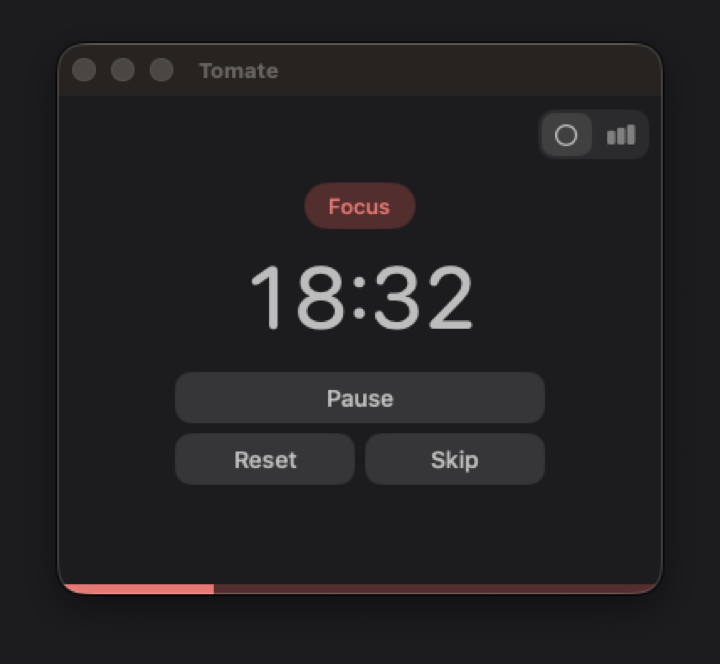
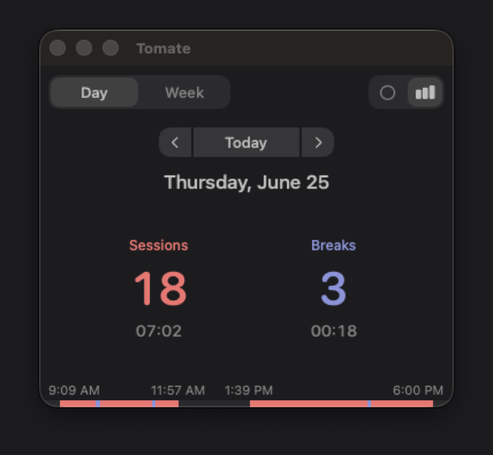
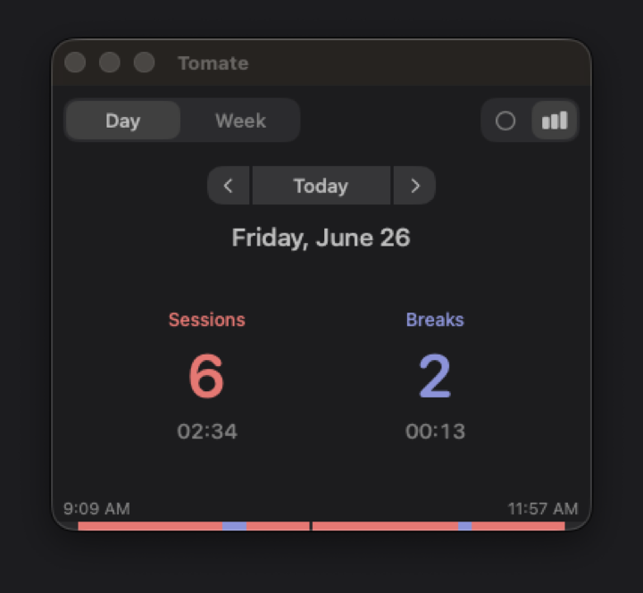
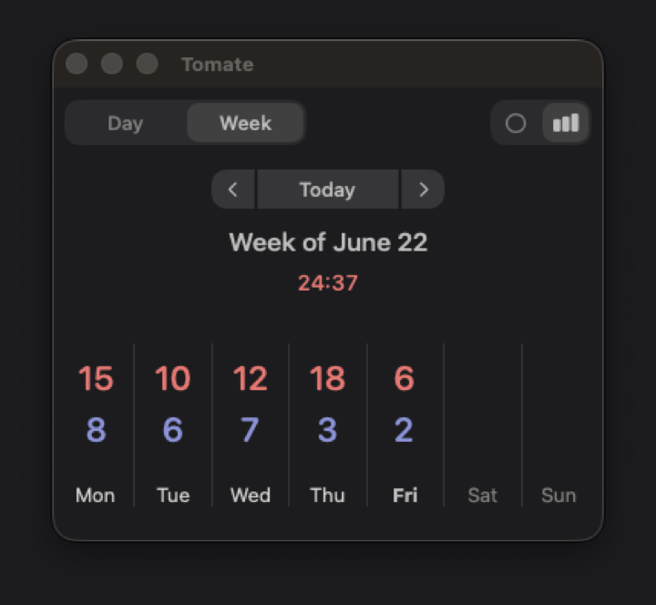

# Tomate

Native Pomodoro timer for macOS. Simple, lightweight, and fully local.

<p align="center">
  
  
  
  
</p>

## Features

- **Timer:** Focus and break cycles. Start, pause, skip, or reset anytime.
- **Timeline:** Hour-by-hour view of your day’s work sessions.
- **Stats:** Day and week views: sessions completed, breaks taken, total focus time.
- **Local only:** History stays on your Mac. No account, no cloud.
- **Settings:** Session and break lengths (25 / 5 min by default), auto-start breaks, language, first day of week.
- **Language:** 🇬🇧 English / 🇫🇷 Français; follows your Mac’s language, or pick one in settings.
- **Reliable:** Pauses when the Mac sleeps or locks; picks up where you left off.

## Requirements

- macOS 14+
- [Xcode](https://developer.apple.com/xcode/) 26+

## Quick start

**Run in development** (Debug build, opens the app):

```bash
./debug.sh
```

**Install to** `/Applications` (Release build):

```bash
./install.sh
```

To install elsewhere: `INSTALL_DIR=~/Applications ./install.sh`

**Settings**: Tomate menu → Settings, or `⌘ ,`

## Tests

```bash
xcodebuild \
  -project Tomate.xcodeproj \
  -scheme Tomate \
  -destination 'platform=macOS' \
  test
```

## Structure

```
Tomate/
  Models/         Timer, sessions, stats, timeline layout
  Views/          SwiftUI screens and components
  Persistence/    Core Data stack and entities
  Preferences/    UserDefaults keys and accessors
  Platform/       Sleep/lock monitors, window management
  Theme/          Colors, strings, layout metrics
TomateTests/      Unit tests
Resources/        App icon and asset catalog
debug.sh                        Debug build + launch
install.sh                      Release build + install to Applications
docs/generate-screenshots.sh    Regenerate docs/screenshots PNGs
```

## License

Tomate is licensed under the MIT License. See the [LICENSE](LICENSE) file for more information.